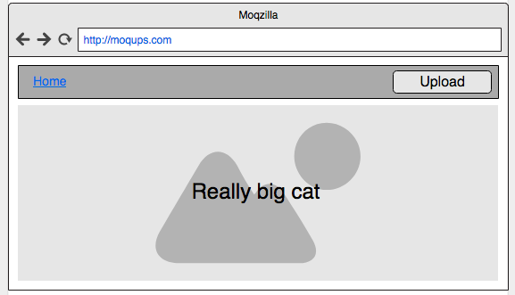

# Vue Sprint
### This was created during my time as a [Code Chrysalis](https://codechrysalis.io) Student

## Table of Contents

1.  [Introduction](#introduction)
1.  [Objectives](#objectives)
1.  [Environment](#environment)
1.  [Requirements](#requirements)
1.  [Installing Dependencies](#installing-dependencies)
1.  [Requirements & Instructions](#objectives-and-instructions)
1.  [Basic Requirements](#basic-requirements)
1.  [Advanced Requirements](#advanced)
1.  [Resources](#resources)
1.  [Contributing](#contributing)

## Introduction

Dive into Vue, a front end framework quickly gaining recognition as a popular alternative to React and Angular. This framework is known for two-way data binding and ability to easily insert and scale into other applications.

## Objectives

In this task students will:

- Learn a new framework using documentation
- Be able to clearly state similarities and differences between front-end frameworks
- Use Vue's single-file architecture to develop a photo upload app
- Use the basics of Vue architecture: create components, use lifecycle methods, and pass data

## Environment

### Requirements

- Node.js

### Installing Dependencies and Starting Up

To install the dependencies for this project:

```shell
  $ yarn
```

To run eslint:

```shell
  $ yarn lint
```

To run unit tests:

```shell
  $ yarn test:unit
```

To run the app in development with hot reloading:

```shell
  $ yarn dev
```

To create a production-ready build and serve through a simple server:

```shell
  $ yarn start
```

## Requirements and Instructions

### Basic Requirements

For this activity, you should be replicating the photo upload app you build in React, but in Vue. You will end up with the same five components: App, Navbar, Upload, AllPhotos, and SinglePhoto.

Use the [Vue docs](https://vuejs.org/v2/guide/) to explore this framework. You _will_ have to learn new technologies and frameworks often, so this activity is designed to push you to get better at reading documentation.

Note that we will be using [single file components](https://vuejs.org/v2/guide/single-file-components.html) for this Vue app. Read this page closely so you understand the difference in syntax. Most of the structure of this app has been set up for you.

Your component hierarchy will end up resembling the following:

```
  App
    Navbar
      Upload
    AllPhotos/SinglePhoto
```

#### App

This component is the main entry point for your Vue app.

It should store three pieces of data:

- [ ] `currentView`, a string that tells the component whether the user should be shown the AllPhotos or SinglePhoto view.
- [ ] `photos`, an array of images represented as base-64 strings.
- [ ] `selectedPhoto`, an image represented as a base-64 string.

It is also responsible for rendering all of the other components:

- [ ] **Navbar**, which renders the navigation bar for the user. The Navbar is always shown regardless of view.
- [ ] Either **AllPhotos** or **SinglePhoto**, which renders either a grid of all photos or an enlarged version of just one single photo. This render is conditional, based on the `currentView` property of the **App** component's state. Explore the [Vue docs](https://vuejs.org/v2/guide/conditional.html) for ideas for how to render conditional displays in your template.

**App** should default to showing the **AllPhotos** component.

When **App** component mounts, the following should happen:

- [ ] It should pause the Vue lifecycle by calling the `created` method. [Read more about the Vue lifecycle here](https://alligator.io/vuejs/component-lifecycle/). Inside of that method, it should use the utility methods found in the **utils/index.js** file to make a call to Amazon's S3 service to retrieve a list of all items stored on the pre-specified S3 bucket.
- [ ] Then, it should grab each image from that list of items and store it into the `photos` array in the component's data.

#### Navbar

This component should serve as your navigation bar for your Vue app. It should render a title along with the Upload component.

- [ ] The title should be a clickable element that, when clicked, will modify the value of the `currentView` string in the **App** component's data, changing it to `'AllPhotos'`. This is to provide the user with a method of navigating back to seeing the AllPhotos view. You should check out the Vue documentation on [Events](https://vuejs.org/v2/guide/components.html#Sending-Messages-to-Parents-with-Events) for how to handle this interaction.
- [ ] The navbar should also render the Upload component. This component should expect a file to be sent as an argument and is responsible for saving that file to S3 using one of the utility methods found in **utils/index.js** to do so. As a result of this, it should also update the photos array saved in the state of the **App** component.

#### Upload

- [ ] The Upload component renders a `button` element for the purposes of uploading an image.
- [ ] The `input` element should allow users to select a an image file.
- [ ] When an image file has been selected with the `input` element, it should ultimately save that file in a S3 bucket.
- [ ] You should use the `button` element in the component to trigger a click event on the invisible `input` element. Check out the Vue documentation on [Event Handling](https://vuejs.org/v2/guide/events.html) for a look at how to accomplish this.

#### AllPhotos

- [ ] It should render a grid of images based on an array of base64-encoded strings given to it as a prop.
- [ ] The images should not take up the entire screen! Make sure their dimensions allow for a decently-sized grid of images.
- [ ] This array of strings should be passed down as data by the parent **App** component.
- [ ] Each image should be clickable, executing a function that will send the clicked image's index back up to the **App** component.
- [ ] When an individual photo is clicked, it should switch the rendering of the **App** component so that it shows the **SinglePhoto** component instead of the **AllPhotos** component.

#### SinglePhoto

- [ ] It should render a single image that takes up the entire screen!
- [ ] The image it renders should be passed into it as a prop from the **App** component.

#### Wireframes

- All Photos:


- Single Photo:



### Advanced Requirements

- [ ] Add a progress bar or visual overlay while a photo is being uploaded, and make it disappear once the upload is complete.
- [ ] Add Vuex to manage your state. This is similar to Redux, but for Vue. [Read more here!](https://vuex.vuejs.org/guide/)
- [ ] Add unit tests using Vue's test utilities. [Read more here!](https://vuejs.org/v2/guide/unit-testing.html)

## Resources

- [Vue Docs](https://vuejs.org/)

## Contributing

See a problem? Can something be done better? [Contribute to our curriculum](mailto:hello@codechrysalis.io)!
